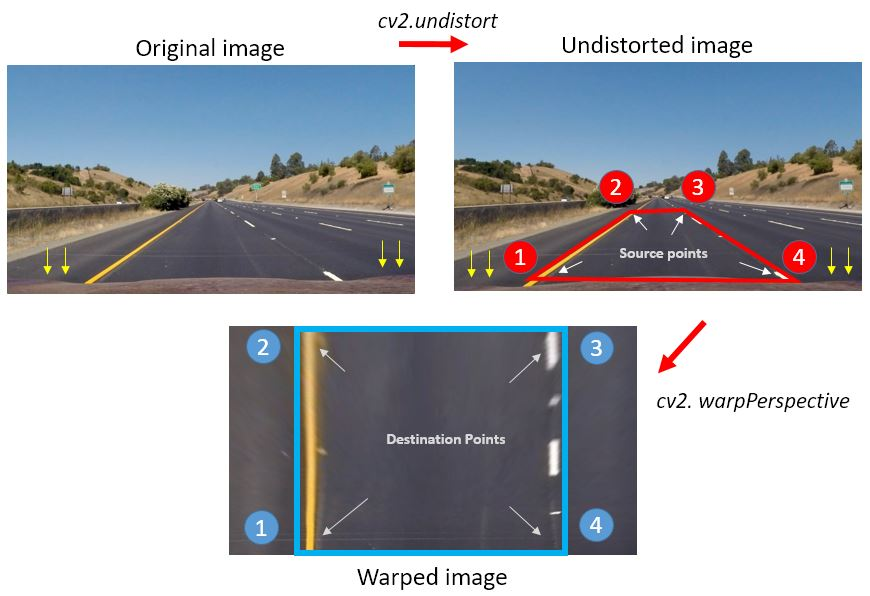
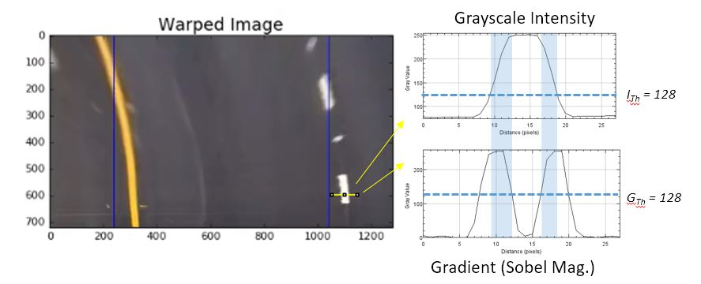
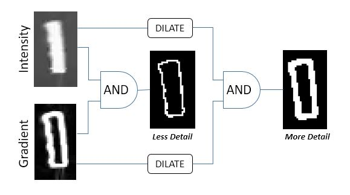
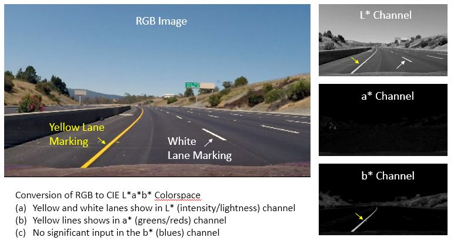
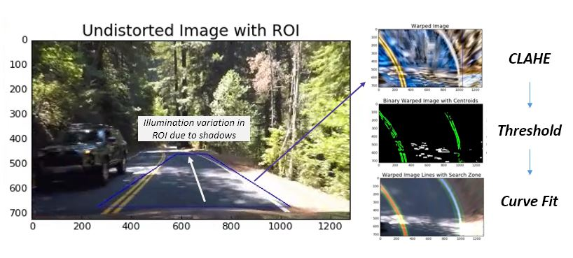
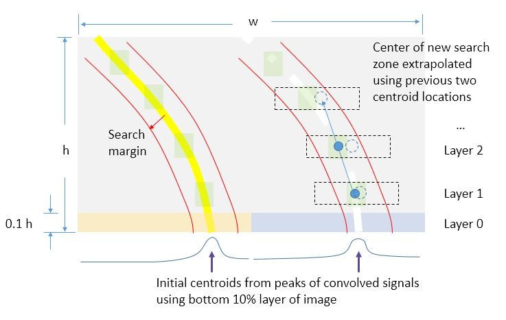
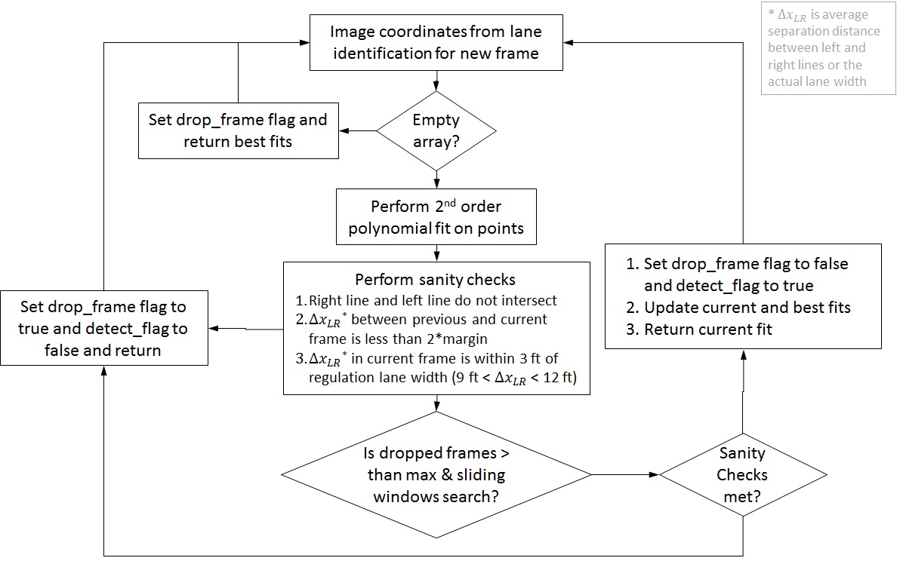

# Advanced Lane Finding Project Report Overview

The repot for the advanced lane finding project is divided into six different sections. An overview of the contents is provided below. In the first section, ***camera calibration*** procedure is described. In the second section, the methodology and steps for ***performing distortion*** correction and identifying ROI for ***perspective transformation*** are discussed. In addition, the approach to determine the associated calibration for pixel coordinates to physical coordinates is presented. In the third section, the ***gradient/color threshold*** process to determine the pixels/centroids corresponding to the lane lines (yellow or white) is discussed. In the fourth section, the definition of the lane marking ***Line class*** is presented. Also, the method used to identify the lane marking centroids is presented. In the fifth section, the strategy adopted for ***curve fitting*** the pixels/centroids for lane lines is presented. In this section, the sanity checks used to determine a valid fit result for lane line is also discussed. Finally, in the last section, an overview of the ***visualization*** strategy used to present an overview of the whole process is described. The implementation of the code is presented in two files: *find_lines_v3.py* and *find_lines_v4.py*. The first implementation works well with *project_video.mp4* and *challenge_video.mp4*. The second implementation has some improvements (e.g., _CLAHE_) that worked well with all three video files. In the final sections, the video pipeline processing and ***results*** are discussed. Further enhancements to the implementation to improve robustness are also discussed.

[TOC]

---

# Section 1: Camera Calibration

The camera was calibrated using images provided in the GitHub project repository under the folder *'CarND-Advanced-Lane-Lines/camera_cal.'* The calibration images were taken using a 6x9 chessboard calibration pattern. In the following, the camera calibration was performed using OpenCV functions *cv2.findChessboardCorners* and  *cv2.calibrateCamera*.

## 1.1 Initialize and load calibration data

The variables for object and image points were initialized using the following code. The object points are the coordinates of the corners on the chessboard. These coordinates are fixed for a given chessboard pattern (6x9). The object points `objp` are initialized and appended to calibration dataset `objpoints` for each calibration image. The `imgpoints` variable is used to store the coordinates of the corners in the image plane, as obtained from `cv2.findChessboardCorners` function.

```python
# prepare object points
objp = np.zeros((6*9,3), np.float32)
objp[:,:2] = np.mgrid[0:9,0:6].T.reshape(-1,2)

# Arrays to store object points and image points from all the images.
objpoints = [] # 3d points in real world space
imgpoints = [] # 2d points in image plane.

# Load calibration data filenames
images = glob.glob('./camera_cal/calibration*.jpg')
```

## 1.2 Perform calibration and save matrices

The code for loading calibration data and processing it is shown below. For each calibration image, the object coordinates for each chessboard corner is mapped to the image plane coordinate (`cv2.findChessboardCorners`). The mapping is visualized using `cv2.drawChessboardCorners`. Finally, the camera is calibrated using all the object/image coordinate pairs from each calibration image.

```python
for fname in images:
    img = cv2.imread(fname)
    gray = cv2.cvtColor(img,cv2.COLOR_BGR2GRAY)
    ret, corners = cv2.findChessboardCorners(gray, (9,6),None)
    if ret == True:
        objpoints.append(objp); imgpoints.append(corners)
        img = cv2.drawChessboardCorners(img, (9,6), corners, ret)
        cv2.imshow('img',img) ; cv2.waitKey(500)     
ret, mtx, dist, rvecs, tvecs = cv2.calibrateCamera(objpoints, imgpoints,
                                   				  gray.shape[::-1], None, None)
```

The above code returns the camera internal matrix `mtx` and the distortion matrix `dist` for the chosen camera. These matrices can be reused throughout the study. It is assumed that the video provided for the project has been acquired using the identical camera/lens configuration, preferably the same camera. For the purpose of reusing the calibration set, the matrices were written to a pickle file and loaded as necessary.

```python
pfile = open('camera_cal.p','wb')
pickle.dump({'objpoints':objpoints, 'imgpoints':imgpoints,
             'mtx':mtx, 'dist':dist}, pfile)
pfile.close()
```

When needed, the calibration data was retrieved from the pickle file using the following code.

```python
dist_pickle = pickle.load(open('./camera_cal.p', 'rb'))
mtx = dist_pickle['mtx']
dist = dist_pickle['dist']
```

---

#Section 2: Distortion correction and perspective transformation

## 2.1 Identification of Region-of-Interest

The region of interest was identified using the test image (straight_lines1.jpg). The points and visualization were always presented on the undistorted image. For this purpose, the *straight_lines1.jpg* file was corrected using the camera calibration data previously obtained. The source points were identified on the undistorted image such that the warped lane lines are vertical and parallel.

These settings were obtained by using the following procedure:

1. *Undistort* the straight_lines1.jpg test image provided in the project using the above camera calibration data.
2. Source points were obtained by tracing a polygon along the edges of the straight lane lines.
3. The region of image showing the the hood is ignored (~60px from bottom).
4. The height of the polygon was maximized to get the best estimate of curvature (~0.66 of height to horizon).
   Note: Excessive distortion in color and gradients of lane lines was observed if the top line was kept close to the horizon.
5. Minor adjustment to polygon points was necessary to ensure the lane lines were vertical in the perspective transformed (warped) image.

In the above, it is assumed that (a) Car is driving at the center of the lane and camera is mounted on the line of the car and (b) the same camera and mounting system was used in all project videos. An example of the the ROI drawn on top of undistorted image is show below.

The source and destination points identified using the straight lines example image (after removing distortion) are tabulated below. Note that the transformation into the destination points provides about 240px margin on either side to account for curvature in the lane marking in a turn.

| Point # |   Source    | Destination |
| :-----: | :---------: | :---------: |
|    1    | (267, 670)  | (240, 720)  |
|    2    | (580, 460)  | (240,   0)  |
|    3    | (705, 460)  | (1040,  0)  |
|    4    | (1039, 670) | (1040, 720) |

## 2.2 Perspective Transformation

These source and destination points were used to compute the perspective transformation matrix using the `cv2.getPerspectiveTransform` function. The perspective transformation matrix and its corresponding inverses are stored in the memory. These will be applied to each frame from the project videos during analysis. Following lines of code summarize these steps.

```python
src = np.float32([[267, 670],  [580, 460], [705, 460], [1039, 670]])
dst = np.float32([[240, 720],  [240,   0], [1040,  0], [1040, 720]])
M = cv2.getPerspectiveTransform(src, dst)
Minv = np.linalg.inv(M) # Inverse transformation matrix
```

The undistortion and perspective transformation is applied to each frame of the video file using the following code. Example images during this pipeline is shown below.

```python
# img is input frame from video
# mtx/dist are camera calibraiton matrices
# M is the tranformation matrix obtained above
# w/h are output image dimensions (same as input image)
undist = cv2.undistort(img, mtx, dist, None)
warped = cv2.warpPerspective(undist, M, (w, h), flags=cv2.INTER_LINEAR)
```




---

# Section 3: Color and Gradient Thresholds

Color/intensity and gradient thresholds are used to identify the lane markings. The grayscale intensity and the gradient (Sobel magnitude) plots across the lane marking is shown in the figure below. The color/intensity remains high across the width of the lane marking, but the gradient reaches a peak at the edge of the marking and is close to zero elsewhere. It can be seen that the after using the threshold for intensity (`ITh`) and gradient (`GTh`), only a narrow region at the edge of the margin is retained. During testing, it was found that marking where the grayscale intensity and gradients are sufficiently low, the thersholidng values do not pickup the feature properly. In order to prevent this, additional morphology operation is performed after color/intensity and gradient thresholds.



## 3.1 Gradient Threshold

The gradient threshold is computed using the following code. The Sobel filter is used to compute the gradient in each  (X&Y) direction and the magnitude is computed. The magnitude of Sobel gradient is used to threshold the figure in the range of 25-110.

```python
gray = cv2.cvtColor(img, cv2.COLOR_RGB2GRAY)
# Take gradient in x and y separately (can try for color channels too)
sobelx = cv2.Sobel(gray, cv2.CV_64F, 1, 0, ksize=5)
sobely = cv2.Sobel(gray, cv2.CV_64F, 0, 1, ksize=5)
# Calculate the magnitude 
abs_sobel = np.sqrt(np.square(sobelx) + np.square(sobely))
# Scaled Sobel gradients
scl_sobel = np.uint8(255*abs_sobel/np.max(abs_sobel))
# Create a binary mask where mag thresholds are met
sobel_binary = np.zeros_like(scl_sobel)
sobel_binary[(scl_sobel >= 25) & (scl_sobel <= 110)] = 1
```


## 3.2 Color Threshold

The implementation for this project adopts a slightly different approach from that described in the course lectures. Instead of relying on grayscale intensity or saturation channel (from HSV), the lane lines are identified using the RGB color level for yellow and white line marking separately. This avoids brighter colors such as greens and reds (from vegetation or other vehicles) to be included in the threshold. Since the yellow and white lines have a specific level in each of R, G & B channels - the following code was found to perform much better. Once the yellow and white lines are thresholded using separate images, the pixles are combined using *OR* operation.

```python
R = img[:,:,0] ; G = img[:,:,1] ; B = img[:,:,2]
# Identify only yellow lane by using RGB distribution for yellow
yline = np.zeros_like(R) ; wline = np.zeros_like(R)
yline[(R > 220) & (G > 210) & (B < 160)] = 1
# Identify only white lane by using RGB distribution for yellow
wline[(R > 200) & (G > 200) & (B > 200)] = 1
# Combine (ORed) both image to include all (yellow/white) lane markings
color_binary = np.zeros_like(R)
color_binary = (yline|wline)
```

## 3.3 Combing Gradient and Color Thresholds

The information from the color/intensity and gradient threshold is combine using an *AND* operation. It was noticed during initial trials that the lane markings at a distance (near the horizon) that are not in the focal plane of the camera, tend to have lower intensity and gradients. As a result, the *AND* operation resulted in lower detail - and in many cases cropped lane markings. In order to circumvent this problem, the binary threshold images were processed using morphology operation (`cv2.dilate`). This improve the detail  in the lane marking across the height of the image, almost all the way upto the horizon, as shown in the figure below.

```python
sobel_binary = cv2.dilate(sobel_binary, np.ones((5,5),np.uint8), 1)
color_binary = cv2.dilate(color_binary, np.ones((10,10),np.uint8), 1)
warpd_binary = sobel_binary & color_binary
```



## 3.4 Note on varying illumination/shadows

For the *harder_challenge_video*, the above color thresholding technique was not as effective in the *project_video* or the *challenege_video*. For the regions of the road that have varying intensity of light, the R/G/B channel levels vary significantly. In particular, the shadow cast by trees on lane markings is particularly difficult to handle. As a result, the threshold image does not retain pixels corresponding to yellow and white lines.

In order to overcome this issue, the RGB colorspace was transformed to the CIE L\*a\*b\* colorspace. Although, any colorspace that resolves RGB to an intensity channel can be used (e.g., HSV, HSL, YUV, etc.), the CIELAB colorspace was found to best represent that human vision perception. Some interesting reads on this topic are listed below.

- [Adobe Technical Guides](http://dba.med.sc.edu/price/irf/Adobe_tg/models/main.html)
- [Wikipedia on CIELAB Color Space](https://en.wikipedia.org/wiki/Lab_color_space)
- [Prof. Hoiem @ UIUC](http://aqua.cs.uiuc.edu/site/files/cvpr11_shadow.pdf)
- [Dr. Molina-Conde @ U Malaga](https://www.eso.org/sci/facilities/develop/detectors/optdet/docs/papers/Colour_computer_vision_ESO_2.pdf)
- https://www.cv.tu-berlin.de/fileadmin/fg140/VISAPP_2014_127_CR.pdf
- [Prof. Cipolla @ Cambridge](http://mi.eng.cam.ac.uk/~cipolla/lectures/4F12/Slides/4F12-colour-vision-notes.pdf)

An example of the RGB lane lines image represented in the CIELAB color space is shown below. As can be seen, the yellow and white lane markings are clearly denoted by their intensity in the L* channel. The yellow line is clearly denoted in the b* channel. 




However, the challenge of varying intensity is still present in the CIELAB color space. This was evident in the *harder_challenge_video* project file. To overcome this limitation, ***CLAHE*** (_**C**ontrast **L**imited **A**daptive **H**istogram **E**qualization_) was performed on L* and b* channels to enhance the yellows and whites. The image was then converted back into the RGB color space. The color threshold was then applied as described in the previous section. The following code illustrates the settings and steps for taking an RGB input image and applying color/contrast corrections in CIELAB space and converting back to RGB. The subsequent image illustrates this process using a frame from the *harder_challenge_video* project file.

```python
clahe_l = cv2.createCLAHE(clipLimit=40.0, tileGridSize=(10,10))
clahe_b = cv2.createCLAHE(clipLimit=5.0, tileGridSize=(5,5))
lab = cv2.cvtColor(img, cv2.COLOR_RGB2LAB)
lab[:,:,0] = clahe_l.apply(lab[:,:,0])
lab[:,:,2] = clahe_b.apply(lab[:,:,2])
img = cv2.cvtColor(lab, cv2.COLOR_LAB2RGB)
# Now follow with color threshold strategy as discussed above
```



---

# Section 4: The *Line* Class

## 4.1 Definition

Once the pixels corresponding to the yellow and white lines are identified using the procedure described in Section3, curve fitting can be done to determine the drivable region. In order to facilitate book-keeping, a python class definition for the lane marking *Line* was used. The following code shows its definition.

```python
import numpy as np
from collections import deque
class Line():
    def __init__(self):
        # was the line detected in the last iteration?
        self.detected = False  
        # x values of the last 5 fits of the line
        self.recent_fits = deque(maxlen=5)
        #polynomial coefficients averaged over the last n iterations
        self.best_fit = np.empty((0,3),np.int8)  
        #polynomial coefficients for the most recent fit
        self.current_fit = np.empty((0,3),np.int8)
        #radius of curvature of the line in some units
        self.radius_of_curvature = None 
```

The above definition was derived from the course notes, but was adapted to keep only relevant information. An important addition to the class definition is the use of `deque` collection (note import statement). This is a FILO (first-in last-out) constant size buffer that allows to dynamic update and stores only the last 5 fits to each lane line. This is convenient rather than implementing the list update mechanism.

## 4.2 Initialization 

Each left and right lane marking can be tracked by initializing a *Line* class.

```python
left_line = Line()
right_line = Line()
```

During curve fitting of lane lines, each *Line* object is updated if the sanity checks (discussed later) are met.

## 4.3 Lane identification 

Lane identification was performed using the function `find_window_centroids`. This function takes the threshold image obtained from previous steps and identifies the location of centroids of the sliding convolutional window where the maximum number of pixels are present in predefined layers of the image. The number of layers are determined by the height of the sliding window. For example, for the project, the image height for each frame is 720 and the sliding window height is 80. Therefore, the number of layers in which centroids will be searched is 9. The search strategy is slightly modified from the technique presented in the classroom / course notes. The following image illustrates the process of finding the centroids.



The search is carried out using the following steps

1. The window centroid location of the first layer is obtained by finding the peaks of convolved signal of pixels over a narrow strip of height 0.1*h as show above. The left half of the strip is used to identify the starting location of left lane and the right half is used to identify starting location for right lane.
2. Once the centroid in previous layer is found, a new search window for convolution of signal is defined in the next layer of the image. The extent of the search window is determined using  the margin specified for lane finding. In this implementation, the new location of the center of the search window is next layer is linearly extrapolated from the centroid of previous layers. This greatly improves accuracy and robustness of finding centroids where the lane curvature is low - i.e., the lane pixel centroid location change in next layer is larger than the margin. This helps in cases when use of large margin gives rise to more false positives for lane pixels due to improper thresholding or noise in the image.
3. This process is performed for both left and right lanes simultaneously.
4. Once the lane centroids are identified using this search strategy, the subsequent frame search is done using all pixels found within the margins.


---

# Section 5: Curve fitting strategy

## 5.1 Calibration for pixels to physical distance conversion

Before curve fitting is performed, the physical distance corresponding to pixel in each direction, height and width, of the image was identified. These calibration values are critical to accurately predict the curvature of the drivable region ahead of the car. The calibration steps process uses federal standards for lane marking from the *Manual on Uniform Traffic Control Devices (MUTCD)* of [Federal Highway Administration](https://www.fhwa.dot.gov/) in the United States, as the video data is from that region. The length and width of lane marking on highways/freeways are available from [California DOT](http://www.dot.ca.gov/trafficops/camutcd/camutcd2014rev2.html) or [FHWA](https://mutcd.fhwa.dot.gov/htm/2009r1r2/html_index.htm) (see Chap3A section 3A.06 for broken white line with and figure 3A-102 Detail 11 for broken white line length). The procedure to identify pixels per meter in the X (width) & Y (height) direction is described below.

 1. From video feed, select a frame that has best centerline view of a straight section of the freeway with at least one broken white lane.
 2. Undistrot and warp image using calibration data and a chosen ROI
 3. Determine the center to center distance of one two lane marking in pixels. The standard lane width (12 ft or 3.66 meters) is then used to compute the meters per pixel value in X or image width direction (*xm_per_pix* = 3.66 meters / measured pixels).
 4. Determine the length of at least 3 long broken lane markings in pixels. The standard length of broken lane marking (12 ft or 3.66 meters) is then used to compute the meters per pixel value in Y or image height direction (*ym_per_pix* = 3.66 meters / average measured pixels). Care has to be taken to ensure that the measurement is done on broken lane markings that are fairly vertical.
 5. For this study, the calibrated factors were: *xm_per_pix* = 0.004753 and *ym_per_pix* = 0.040667

## 5.2 Curve fitting strategy

The curve fitting is implemented in the code using the `polyfit_and_compute_radcurv` function. This function fits a 2nd order polynomial to the image coordinates returned by lane identification algorithm. These coordinates could be the centroids of the sliding convolutional windows (newly identified lane line) or all the pixel identified within the margin (previously identified lane line). If no image coordinate are found, the best fit for the *Line* class object, i.e., the average of five previous fits, is returned. The following code is used to compute the polynomial fits.

``` python
lfit = np.polyfit(lcpts[:,1], lcpts[:,0], 2)
rfit = np.polyfit(rcpts[:,1], rcpts[:,0], 2)
```

After the curve fitting is done, three sanity checks are performed to ensure that the new lane fit is valid. If all the sanity checks are satisfied, the left and right *Line* objects are updated using the following code.

```python
df_flag = False
num_drop_frames = 0
lline.detected = True ; rline.detected = True
lline.current_fit = lfit ; rline.current_fit = rfit
lline.radius_of_curvature = lcrv ; rline.radius_of_curvature = rcrv
lline.recent_fits.append(lfit) ; rline.recent_fits.append(rfit)
lline.best_fit = np.mean(lline.recent_fits, axis=0)
rline.best_fit = np.mean(rline.recent_fits, axis=0)
return df_flag, lline, rline
```

In the even that the sanity checks are not met, the fits for current frame are dropped. The following code is used. The number of dropped frames is tracked and status is shown on the output video feed for visualization.

```python
df_flag = True
lline.detected = False
rline.detected = False
num_drop_frames += 1
all_drop_frames += 1
return df_flag, lline, rline
```
The following flowchart illustrates the steps involved in curve fitting and the sanity checks on newly fitted lane lines.



The update strategy includes the use of maximum allowable dropped frames after which a sliding window search is forced. The maximum allowable dropped frame count is related to the frame rate. For practical considerations, only 0.5 seconds worth of frames are allowed to be dropped before the sliding window search is forced. If sanity checks still do not meet, the frames are dropped until a valid lane fit is obtained.

---

# Section 6: Visualization

The project video output displays the intermediate output at each section described above in a single frame. The original video, undistorted frame with ROI, the warped ROI, lane detection and markings are presented in a single figure window. In addition, the drivable lane region is superimposed on the original video frames (undistorted) along with status of dropped frame for easy visualization. An example frame from output video is shown below.


The above plot was made using two helper function: `plot_warped_lane_regions` and `plot_lanes_on_undist`. These function are based on the code provided in the course notes, so will not be described in detail. The additional features is the feedback of dropped frame using `cv2.circle` and `cv2.text` on the top right corner of the original video frame. The output image from each helper function is assembled into subplot axes in the above figure using `gridspec.GridSpec` method.

------

#Section 7: Results

The video output from the project video files is presented below. All three input videos were successfully processed using the current algorithm/code implementation. The following table summarizes the robustness of the algorithm to each project video. Links to complete output from project video are embedded in the filename column. An example snip from the output is shown below.

| Video Filename                           | Video Length  | Frames | Dropped Frame Count (%) | Remarks                                  |
| ---------------------------------------- | ------------- | ------ | ----------------------- | ---------------------------------------- |
| [*project_video.mp4*](./project_output.mp4) | 50.4 seconds  | 1260   | 75 (5.95%)              | Tracks lane lines very well due to uniform illumination and good contrast |
| [*challenge_video.mp4*](challenge_output.mp4) | 16.15 seconds | 484    | 98 (20.2%)              | Frame drop count increased, but recovery from dropped frames was good - especially after the contrast change from cross under bridge. |
| [*harder_challenge_video.mp4*](harder_challenge_output_compressed.mp4) | 47.76 seconds | 1194   | 367 (30.7%)             | Frame drop count increased due to significant illumination changes from shadows and sharp turns. However, the algorithm performed acceptably well for most of the video. |


An example output form each video is demonstrated below.


| Example output clip #1 for *project_video.mp4* | Example output clip #2 for *project_video.mp4* |
| ---------------------------------------- | ---------------------------------------- |
|  |  |


| Example output clip #1 for *challenge_video.mp4* |
| ---------------------------------------- |
|  |


| Example output clip #1 for *harder_challenge_video.mp4 |
| ---------------------------------------- |
|  |

---

#Section 8: Further improvements

Some of the key problems / issues / learnings from the implementation of this project are listed below:

- Contrast enhancement is imperative to ensure that the algorithm perform robustly.
- Choice of intensity based color spaces to identify lane markings was not as effective as explicit RGB based thresholding. Intensity channels from HSV, HSL and YUV channels were explored, but all were unable to generalize across the videos.
- Some of the parameters such as window height, threshold levels, maximum allowed frame drops, sliding window search aggressiveness had to be tuned across videos. These could be derived emperically based on vehicle speed and lighting conditions outside.
- Windshield reflection, color/gradient match with vegetation/tress and passing cars were some of the challenges that were overcome by carefully tuning the RGB thresholds and limiting the lane search algorithm to specific region of the image (e.g, ignoring the sky above horizon, etc.) 

The pipeline is fairly robust and faired decently for the *harder_challenge_video.mp4* input file. However, the implementation can be made more robust by the following improvements. These points will be revisited in the future for implementation.

- The **_CLAHE_** technique used in this implementation to improve local contrast has its limitations. Shadow removal techniques have improved over the years and some of the implementation have been successful in removing shadows from road/traffic images. Algorithmic ideas from [Figov *et al.*](http://u.cs.biu.ac.il/~koppel/papers/Removing-Shadows.pdf), [Xu *et al.*](http://lxu.me/mypapers/XuL_ShadowRemoval.pdf) and [Guo *et al.*](http://aqua.cs.uiuc.edu/site/files/cvpr11_shadow.pdf) will be explored further for implementation.
- The sliding window technique for search centroids was found to be inadequate if there is fair amount of noise in the frame. This was particularly trouble some in the *harder_challenge_video.mp4* where the reflection of the dash panel off the windscreen was leaking into the threshold image (intensity of the reflection is similar to white lane line). A custom convolution window which better represents the lane marking (single solid, double solid, dashed, etc) can be used to improve accuracy and prevent noise and wash-out pixels from vegetation/trees to creep into the lane fitting function.